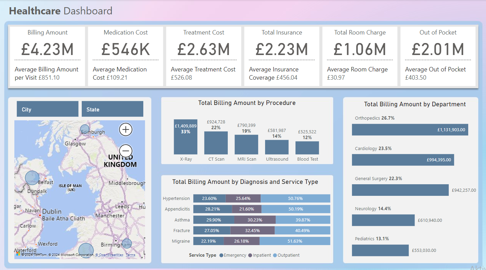

# Healthcare Dashboard

## Overview

This repository contains a PowerBI healthcare dashboard that provides insights into healthcare billing and costs. The dashboard includes visualizations and key metrics to help understand billing amounts, medication costs, treatment costs, insurance coverage, room charges, and out-of-pocket expenses.

To open the interactive dashboard please navigate to `PetrovicsRobert/Healthcare-Analysis` and click on`Healthcare_Analysis.pbix`

## Data Cleaning and Preparation

The data used in this dashboard underwent a cleaning process, which included:

- Finding and, if needed, removing duplicates and null values.
- Standardizing data formats by changing the data type of columns.
- Creating a date table to facilitate time-based analysis, providing a clearer view and helping to ease visualization.
- Calculating key measurements and metrics for visualization.

## Features
#### Total Billing Amount: 
 Displays the overall billing amount along with the average billing amount per visit.
#### Medication Cost: 
Shows the total and average cost of medications.
#### Treatment Cost: 
Represents the total and average cost of treatments.
#### Total Insurance: 
Highlights the total and average insurance coverage.
#### Total Room Charge: 
Details the total and average room charges.
#### Out of Pocket: 
Summarizes the total and average out-of-pocket expenses for patients.
#### Geographical Distribution: 
A map visualizing the distribution of billing amounts across different cities and states in the UK.
#### Billing Amount by Procedure: 
A bar chart showing the total billing amount by various procedures such as X-Ray, CT Scan, MRI Scan, Ultrasound, and Blood Test.
#### Billing Amount by Department: 
A bar chart illustrating the total billing amount by different departments including Orthopedics, Cardiology, General Surgery, Neurology, and Pediatrics.
#### Billing Amount by Diagnosis and Service Type:
 A bar chart showing the total billing amount by diagnosis (Hypertension, Appendicitis, Asthma, Fracture, Migraine) and service type (Emergency, Inpatient, Outpatient).

## Insights

#### High Billing Amount for X-Rays: 
X-Rays posesses the highest total billing amount among procedures, showing that they are a common diagnostic tool and may suggest high usage or high costs associated with this procedure.
#### Significant Costs in Orthopedics: 
The Orthopedics department has the highest total billing amount among departments, which could indicate high procedure costs or a large number of patients needing orthopedic care.
#### Hypertension Management: 
Hypertension shows up often across different service types with significant billing amounts, highlighting the need for effective management and prevention efforts.
#### Emergency vs. Inpatient Costs: 
Emergency services usually make up a larger part of the total bills compared to inpatient services. This points to a possible opportunity to save money by improving how we manage outpatient care and focus more on preventive measures.

## Recommendations

#### Cost Management in High-Expense Departments: 
Focus on cost-reduction strategies in high-expense departments like Orthopedics and Cardiology without compromising patient care.
#### Preventive Care Programs: 
Implement preventive care programs, especially for chronic conditions like hypertension, to reduce emergency visits and inpatient admissions.
#### Optimize Diagnostic Procedures: 
Review the use and costs of diagnostic procedures such as X-Rays and CT Scans to ensure they are used appropriately and cost-effectively.
#### Patient Education: 
Focus on patient education on managing chronic conditions to reduce the need for emergency care.
#### Insurance and Out-of-Pocket Costs: 
Work with insurance providers to optimize coverage and reduce out-of-pocket expenses for patients.

